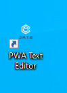
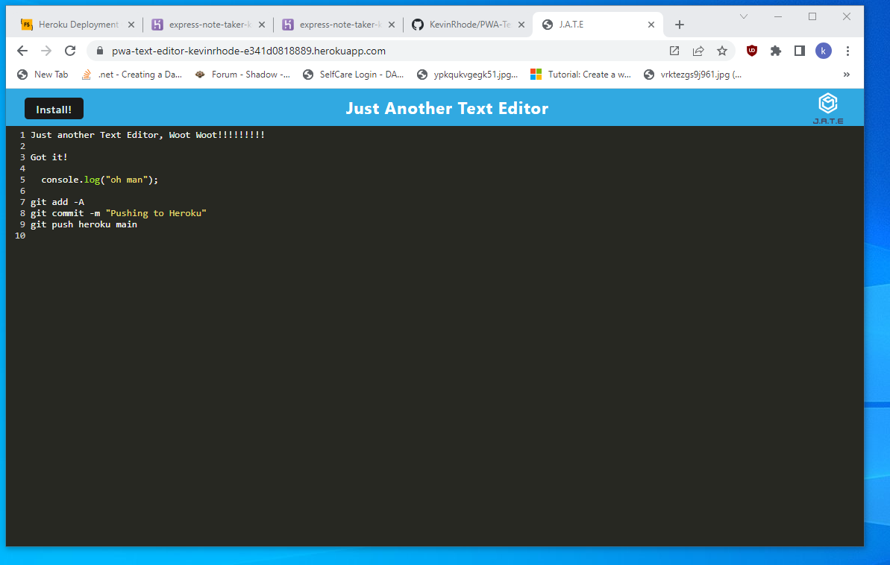
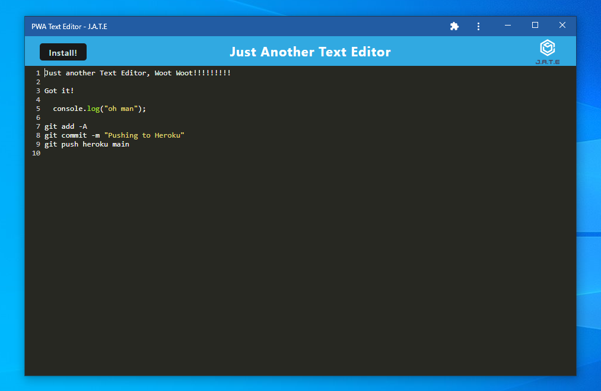

# PWA-Text-Editor

[](https://choosealicense.com/licenses/mit/)
## Description

PWA-Text-Editor is a cutting-edge Progressive Web Application designed to enhance note-taking and code snippet management. With its intuitive styling reminiscent of popular integrated development environments (IDEs), users can enjoy a seamless coding experience. The application leverages IndexedDB for efficient data persistence, ensuring that user content is securely stored. Additionally, local storage serves as a reliable backup solution. The integration of a service worker empowers the application with offline functionality, enabling users to work seamlessly without an internet connection and ensuring a lightning-fast user experience.

  ## Technology Stack

  
  
  
  
  

## User Story
```md
AS A developer
I WANT to create notes or code snippets with or without an internet connection
SO THAT I can reliably retrieve them for later use
```

## Acceptance Criteria 
```md
GIVEN a text editor web application  
WHEN I open my application in my editor  
THEN I should see a client server folder structure  
WHEN I run `npm run start` from the root directory  
THEN I find that my application should start up the backend and serve the client  
WHEN I run the text editor application from my terminal  
THEN I find that my JavaScript files have been bundled using webpack  
WHEN I run my webpack plugins  
THEN I find that I have a generated HTML file, service worker, and a manifest file  
WHEN I use next-gen JavaScript in my application  
THEN I find that the text editor still functions in the browser without errors  
WHEN I open the text editor  
THEN I find that IndexedDB has immediately created a database storage  
WHEN I enter content and subsequently click off of the DOM window  
THEN I find that the content in the text editor has been saved with IndexedDB  
WHEN I reopen the text editor after closing it  
THEN I find that the content in the text editor has been retrieved from our IndexedDB  
WHEN I click on the Install button  
THEN I download my web application as an icon on my desktop  
WHEN I load my web application  
THEN I should have a registered service worker using workbox  
WHEN I register a service worker  
THEN I should have my static assets pre cached upon loading along with subsequent pages and static assets  
WHEN I deploy to Heroku  
THEN I should have proper build scripts for a webpack application  
```


## Installation

Node.js - Verison 16.18.0
  [DownloadLinks](https://nodejs.org/download/release/v16.18.0/)
  Install Node.js
  ```md
Clone Repo - git clone git@github.com:KevinRhode/PWA-Text-Editor.git
  ```
In Git Terminal - navigate to the file location of package.json  
```md
  run : npm install
```
## Usage

To run the application use:

```md
 npm run build

 npm start
```
[Application Deployed](https://pwa-text-editor-kevinrhode-e341d0818889.herokuapp.com/)  
[Application Repo](https://github.com/KevinRhode/PWA-Text-Editor)

## Preview




